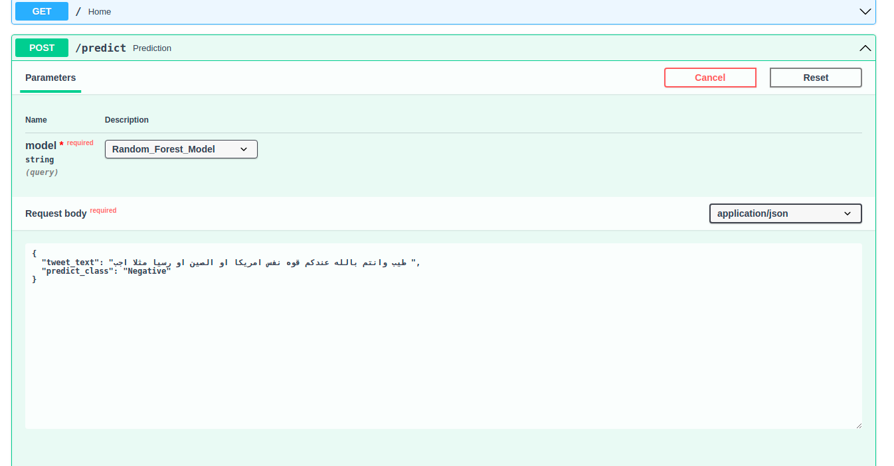
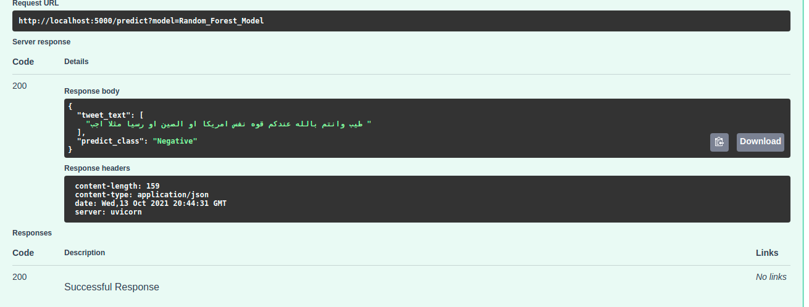

# FastAPI_Deploy_Covid
FastAPI Deploy with Covid classification Task

This simple notebook to deploy machine learning model, I just use the weights of some model I worked on before.

## Try it out on linux

git clone https://github.com/Abdelrahmanrezk/FastAPI_Deploy_Covid.git

cd FastAPI_Deploy_Covid

pip install -r requirements.txt

For other operating system users you can search for to get it work

